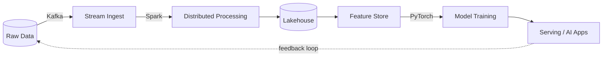

<!-- Replace every YOUR_USERNAME, YOUR_NAME, and link placeholder -->

<div align="center">


</div>

---

## 🖥️ Node Info

```text
$ cat /etc/node-info
node_id     : YOUR_NAME
role        : Data Engineer ⇄ ML Engineer   (student, always training)
cluster     : big-data · machine-learning · deep-learning · ai
consistency : eventual — but I always converge
uptime      : since day one of curiosity

$ kubectl get skills --namespace=YOUR_NAME
NAME                  STATUS      READY   LOAD
data-engineering      Running     3/3     ██████████████░░░░░░  70%
distributed-systems   Running     2/3     ████████████░░░░░░░░  60%
machine-learning      Running     2/3     ███████████░░░░░░░░░  55%
deep-learning         Scaling ↑   1/3     ████████░░░░░░░░░░░░  40%
artificial-intel      Scaling ↑   1/3     ████████░░░░░░░░░░░░  40%
coffee-daemon         Running     ∞/∞     ████████████████████ 100%
```

## 🧬 My Pipeline: data in, intelligence out



## 🚀 Active Jobs

| Job | Status |
|---|---|
| 🏗️ Building a production-grade batch + streaming pipeline | 🟢 Running |
| 🧠 Training, deploying and monitoring ML models end to end | 🟢 Running |
| 🔥 Going deeper into deep learning: CNNs, Transformers | 🟡 Scaling up |
| 🤖 Exploring modern AI: LLMs, RAG, agents | 🟡 Scaling up |

<details>
<summary><b>📜 tail -f /var/log/now.log</b></summary>
<br>

- 🔭 Working on **[project name](https://github.com/YOUR_USERNAME)**
- 🌱 Learning **Apache Spark, Airflow, PyTorch**
- 📚 Reading: *Designing Data-Intensive Applications*
- 💬 Ask me about **data pipelines, distributed systems, or ML**
- ⚡ Fun fact: *something quirky about you*

</details>

## 🧠 Algorithms Hall of Fame

| Algorithm | Domain | Why it's genius |
|---|---|---|
| **Raft** | Consensus | Makes a cluster agree on one truth, and was designed to be understandable |
| **MapReduce** | Big Data | Split, process in parallel, merge. Simple idea, planet-scale results |
| **Consistent Hashing** | Distributed Systems | Add or remove a node and only a small slice of keys move |
| **HyperLogLog** | Big Data | Counts billions of unique items using a few kilobytes |
| **Bloom Filter** | Data Structures | "Definitely not here" or "probably here" in constant space |
| **Vector Clocks** | Distributed Systems | Tracks causality without a global clock |
| **Backpropagation** | Deep Learning | The chain rule, applied at scale, taught machines to learn |
| **Attention** | AI | Let every token look at every other token and the Transformer was born |
| **Adam** | Optimization | Momentum plus adaptive learning rates, the default for a reason |

## 🧰 Tech Stack

<p align="center">
  
  <br><br>
  
</p>

<p align="center">
  
  
  
  
  
  
  
</p>

## 📈 Observability

<div align="center">
  
  
  <br>
  
  <br>
  
</div>

## 📡 Gossip Protocol over my Contributions

<div align="center">
  <picture>
    <source media="(prefers-color-scheme: dark)" srcset="https://raw.githubusercontent.com/YOUR_USERNAME/YOUR_USERNAME/output/gossip-dark.svg"/>
    <source media="(prefers-color-scheme: light)" srcset="https://raw.githubusercontent.com/YOUR_USERNAME/YOUR_USERNAME/output/gossip-light.svg"/>
    
  </picture>
  <br>
  <sub>Each day is a node. My busiest day is elected leader, and the rumor spreads by push-gossip until the whole cluster converges in O(log N) rounds. Regenerated daily.</sub>
</div>

## 🔌 Open a Connection

<p align="center">
  <a href="https://linkedin.com/in/YOUR_LINKEDIN"></a>
  <a href="mailto:YOUR_EMAIL"></a>
  <a href="https://kaggle.com/YOUR_KAGGLE"></a>
  <a href="https://huggingface.co/YOUR_HF"></a>
</p>

<div align="center">

```text
SYN → SYN-ACK → ACK   ·   connection established. thanks for visiting.
```


</div>
